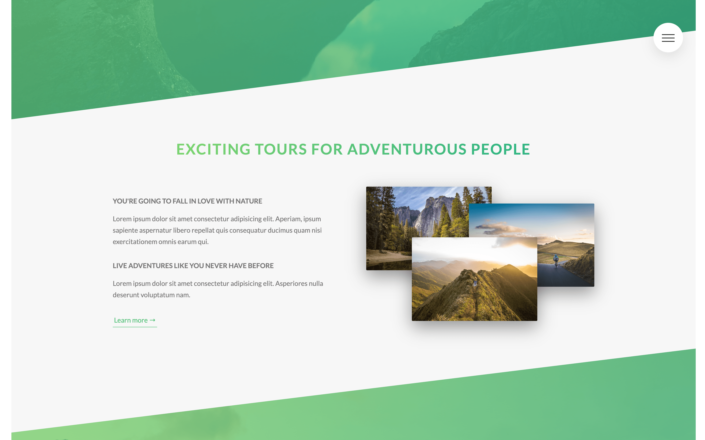
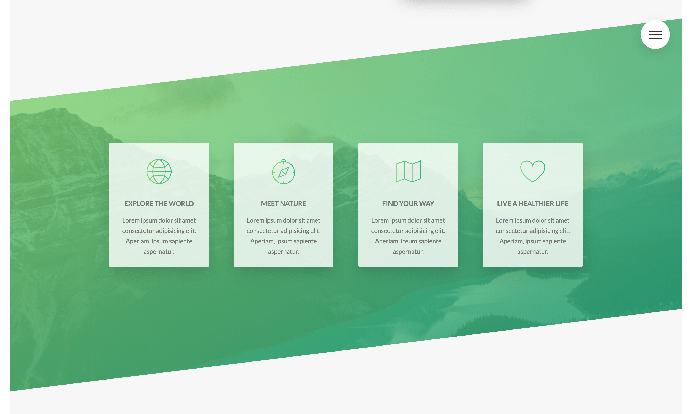
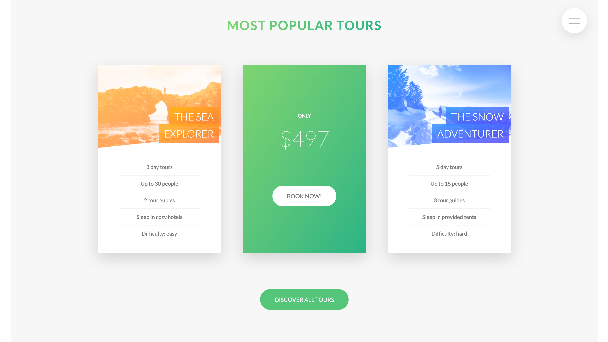

# Travel app template using HTML5, CSS and SASS

This repo contains a travel app template project from Udemy course [Advanced CSS and Sass: Flexbox, Grid, Animations and More!](https://www.udemy.com/course/advanced-css-and-sass/) by Jonas Schmedtmann.

Production ready responsive website. Project can be used to see some advanced CSS animations with @keyframes, animation and transition.

### &nbsp;

### &nbsp;

### &nbsp;

